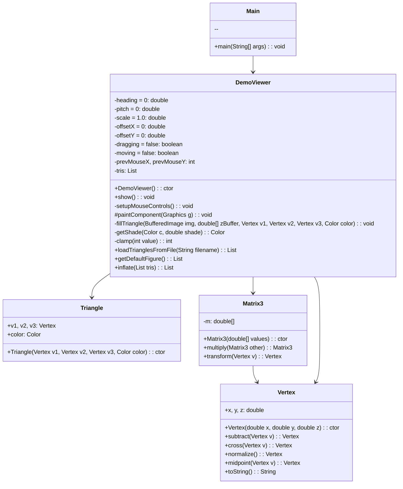

# Руководство по созданию 3D-визуализатора на Java

Данный проект представляет собой 3D-визуализатор, предназначенный для отображения трёхмерных моделей с возможностью их вращения, масштабирования и перемещения. Визуализация реализована на языке Java с использованием простых математических преобразований и графического интерфейса.

## Оглавление

1. [Введение](#введение)
2. [Необходимые инструменты](#необходимые-инструменты)
3. [Структура проекта](#структура-проекта)
4. [Создание классов для работы с 3D-объектами](#создание-классов-для-работы-с-3d-объектами)
   - [Шаг 1: Создание класса `Vertex`](#шаг-1-создание-класса-vertex)
   - [Шаг 2: Создание класса `Matrix3`](#шаг-2-Создание-класса-matrix3)
   - [Шаг 3: Создание класса `Triangle`](#шаг-3-Создание-класса-triangle)
   - [Шаг 4: Создание класса`DemoViewer`](#шаг-4-Создание-класса-demoViewer)
   - [Шаг 5: Создание класса `Main`](#шаг-5-создание-класса-main)
5. [Пример работы 3D-визуализатора на разных фигурах](#пример-работы-3D-визуализатора-на-разных-фигурах)
6. [Заключение](#заключение)

---

## Введение
Прежде чем приступить к реализации кода, важно разобраться с фундаментальными математическими концепциями, на которых основана работа 3D-визуализатора. Эти понятия являются неотъемлемой частью любой системы трехмерной графики и позволяют описывать и преобразовывать объекты в пространстве.

**Векторы** — это математические сущности, определяющие направление и величину в 3D-пространстве. Вектор с координатами (x, y, z) может представлять направление движения, положение точки или нормаль к поверхности.

**Матрицы** — используются для преобразования объектов: поворота, масштабирования, перемещения и отражения. С помощью матричных операций можно изменять координаты точек, формируя нужное положение объекта в трехмерной сцене.

**Проекция** — это процесс перевода трёхмерной сцены в двумерное изображение, которое можно отобразить на экране. Проекция позволяет наблюдать 3D-объекты с заданной точки зрения и воспринимать глубину сцены.

Эти принципы составляют математическую основу визуализации в 3D, и мы будем активно использовать их при создании всех ключевых компонентов проекта.

---
## Необходимые инструменты
### 1. Установка необходимого ПО
- **IDE (IntelliJ IDEA, Eclipse или NetBeans)**: Рекомендуем IntelliJ IDEA для начинающих. Бесплатную версию можно скачать [здесь](https://www.jetbrains.com/idea/download/).

### 2. Создание проекта
1. Откройте IDE и создайте новый Java-проект.
2. Добавьте в проект классы из списка ниже [здесь]() для параллельного ознакомления с проектом в целом:
   - `Vertex.java`
   - `Triangle.java`
   - `Matrix3.java`
   - `DemoViewer.java`
   - `Main.java`

---

## Структура проекта

- `Vertex` — для представления точки в 3D-пространстве.
- `Triangle` — для представления *треугольника*, состоящего из трёх вершин.
- `Matrix3` — для работы с *матрицами 3x3*, используемыми для поворота объектов.
- `DemoViewer` — основной класс для визуализации 3D-моделей и управления камерой.
- `Main` - точка входа в приложение.

### Структура классов


---

## Создание классов для работы с 3D объектами
## Шаг 1: Создание класса `Vertex`
Cоздаём класс `Vertex`, который будет представлять точку в 3D-пространстве. Он имеет три координаты: **x, y** и **z**, которые определяют положение вершины в пространстве.

```java
public class Vertex {
    public double x, y, z;
```
**Переменные класса:** Объявляются три переменные типа `double`, которые будут хранить координаты точки в 3D-пространстве: *x, y, z*.

```java
    public Vertex(double x, double y, double z) {
        this.x = x;
        this.y = y;
        this.z = z;
    }

```
**Конструктор класса Vertex:** Конструктор инициализирует объект Vertex с конкретными значениями для *x, y* и *z*. Когда мы создаём объект этого класса, необходимо передать три значения, которые будут использоваться для инициализации координат точки.

### Методы класса `Vertex`

---

##### Метод `subtract`

```java
    public Vertex subtract(Vertex v) {
        return new Vertex(x - v.x, y - v.y, z - v.z);
    }
```
**Описание:** Данный метод принимает другой объект `Vertex` (точку) и возвращает новый объект `Vertex`, представляющий разницу между текущей точкой и переданной точкой *v*. Разница вычисляется по каждой из координат *x, y* и *z*. Метод полезен для вычисления векторного разности между точками.

---
##### Метод `cross`

```java
    public Vertex cross(Vertex v) {
        return new Vertex(
                y * v.z - z * v.y,
                z * v.x - x * v.z,
                x * v.y - y * v.x
        );
    }
```
**Описание:** Данный метод выполняет операцию *векторного произведения* (кросс-продукта) между текущим вектором (this) и вектором *v*, переданным в качестве аргумента. 
Результат операции векторного произведения двух векторов — это новый вектор, который перпендикулярен обоим исходным векторам. 
*Формула для вычисления кросс-продукта*:


В коде это аналогично вычисляется для текущего вектора и переданного вектора *v*.

---
##### Метод `normalize`

```java
    public Vertex normalize() {
        double length = Math.sqrt(x * x + y * y + z * z);
        if (length == 0) return new Vertex(0, 0, 0);
        return new Vertex(x / length, y / length, z / length);
    }
```
**Описание:** Этот метод нормализует текущий вектор, т.е. делает его единичной длины. 
*Для этого вычисляется длина вектора (по формуле длины вектора в 3D-пространстве):*


После этого каждая координата делится на эту длину, чтобы получить вектор с длиной 1. Если длина вектора равна нулю (то есть точка в начале координат), возвращается вектор с координатами (0, 0, 0).

---
##### Метод `midpoint`

```java
    public Vertex midpoint(Vertex v) {
        return new Vertex(
                (x + v.x) / 2.0,
                (y + v.y) / 2.0,
                (z + v.z) / 2.0
        );
    }
```
**Описание:** Этот метод возвращает новый объект `Vertex`, который представляет собой середину (среднюю точку) между текущей точкой и точкой *v*. 
*Средняя точка вычисляется как среднее арифметическое соответствующих координат:*


Это полезно, например, при вычислении центроидов треугольников или других объектов.

---
##### Метод `toString`

```java
    @Override
    public String toString() {
        return String.format("Vertex(%.2f, %.2f, %.2f)", x, y, z);
    }
```
**Описание:** Данный метод переопределяет стандартный метод `toString` и возвращает строковое представление объекта Vertex. Форматирует координаты с двумя знаками после запятой, и выводит строку в виде:

```scss
Vertex(х.xx, y.yy, z.zz)
```
Например, для точки с координатами (1.0, 2.5, 3.7) метод вернёт:

```scss
Vertex(1.00, 2.50, 3.70)
```

## Вывод о классе `Vertex`

Таким образом, класс `Vertex` предоставляет основные методы для работы с точками в 3D-пространстве: вычитание, кросс-продукт, нормализация, нахождение средней точки и вывод строки. Все эти операции часто используются в графике и геометрии для манипуляций с точками и векторами.

---

## Шаг 2: Создание класса `Matrix3`

Класс `Matrix3` представляет собой матрицу 3x3, которая используется для выполнения операций над 3D-объектами, например, для поворота.

```java
public class Matrix3 {
	private final double[] m;

```
**Поле m:** Одномерный массив из 9 элементов (double[]), который хранит все значения матрицы 3×3.
        Матрица хранится **в построчном виде (row-major order):**
	
```css
      [ m0 m1 m2 ]
      [ m3 m4 m5 ]
      [ m6 m7 m8 ]
```

Это значит:
-  m[0] — элемент (0,0)
-  m[1] — элемент (0,1)
-  m[2] — элемент (0,2)
-  и так далее.

---
```java
	public Matrix3(double[] values) {
		if (values.length != 9) {
			throw new IllegalArgumentException("Matrix3 must have exactly 9 elements");
		}
		this.m = values.clone();
	}
```

Конструктор `Matrix3`:
-  Принимает массив `values`, содержащий 9 чисел, и проверяет, что их ровно 9.
-  Если передано меньше или больше, выбрасывается исключение.
-  Если всё корректно, создаётся *копия* массива (clone()) и сохраняется в поле m.

---

### Методы класса `Matrix3`

---

##### Метод `multiply`

```java
	public Matrix3 multiply(Matrix3 other) {
		double[] result = new double[9];
```
Создаётся новый массив `result`, в который будут записаны значения новой матрицы после перемножения.

---

```java
		for (int row = 0; row < 3; row++) {
			for (int col = 0; col < 3; col++) {
				result[row * 3 + col] =
						m[row * 3 + 0] * other.m[col + 0] +
						m[row * 3 + 1] * other.m[col + 3] +
						m[row * 3 + 2] * other.m[col + 6];

```
---

**Циклы row и col:** Двойной цикл по строкам и столбцам, чтобы заполнить каждую ячейку новой матрицы.
*Формула умножения матриц:*


То есть:
-  Строка из первой матрицы (this.m)
-  Столбец из второй матрицы (other.m)
-  Перемножаются и суммируются три элемента, чтобы получить элемент в ячейке `C[row][col]`.
     
**Индекс** `row * 3 + col` используется для доступа к позиции в массиве result.

---
```java
			}
		}
		return new Matrix3(result);
	}
```
Возвращается новый объект `Matrix3` с полученным результатом умножения.

---
##### Метод `transform`

```java
	public Vertex transform(Vertex v) {
		return new Vertex(
				v.x * m[0] + v.y * m[3] + v.z * m[6],
				v.x * m[1] + v.y * m[4] + v.z * m[7],
				v.x * m[2] + v.y * m[5] + v.z * m[8]
		);
	}
```

Этот метод преобразует вектор (объект `Vertex`) с помощью матрицы.
*Вектор `v =(x,y,z)` умножается на матрицу `𝑀` по правилу линейной алгебры:*


Таким образом, каждая новая координата получается как скалярное произведение строки матрицы на вектор координат.
Возвращается новый объект Vertex с преобразованными координатами.

---
## Вывод о классе `Matrix3`

Класс `Matrix3`:

-  Хранит матрицу *3×3* в виде массива.

-  Поддерживает умножение матриц.

-  Может применять матрицу к вектору (точке) — это используется, например, для поворота или масштабирования фигур в 3D-пространстве.

---
## Шаг 3: Создание класса `Triangle`

```java
import java.awt.Color;
```

Импортируется класс `Color` из библиотеки `java.awt`, чтобы можно было задавать цвет треугольника.
**Color** нужен для визуализации — каждый треугольник будет отрисован с определённым цветом.

---
```java
public class Triangle {
```
Объявляется публичный класс Triangle, который представляет один треугольник в 3D-пространстве.
Он состоит из трёх вершин (`Vertex`) и цвета (`Color`), и будет основной единицей отрисовки в 3D-визуализаторе.

---
```java
	public Vertex v1, v2, v3;
```

Объявляются три публичных поля **v1, v2, v3**, представляющие вершины треугольника.
Каждое из них — это объект класса `Vertex`, содержащий координаты *x, y, z*.
Вершины определяют форму и положение треугольника в пространстве.

```java
	public Color color;
```

Объявляется поле *color* типа `Color` — цвет, в котором будет нарисован треугольник.
Это может быть постоянный цвет или цвет, зависящий от освещения (если применить shading позже).

### Конструктор

```java
	public Triangle(Vertex v1, Vertex v2, Vertex v3, Color color) {
		this.v1 = v1;
		this.v2 = v2;
		this.v3 = v3;
		this.color = color;
	}
```
Конструктор принимает 4 аргумента:
*v1, v2, v3* — координаты вершин треугольника;
*color* — цвет треугольника.
Ключевое слово `this` используется, чтобы отличать поля объекта от аргументов конструктора.
Таким образом, создаётся один треугольник в 3D-пространстве с заданными координатами и цветом.

---
## Вывод о классе `Triangle`

**Triangle** — это простой, но важный класс, который служит строительным блоком для отображаемых 3D-объектов. Каждый такой треугольник:

-  Используется в рендеринге (отрисовке) сцен.

-  Может подвергаться трансформациям: поворотам, масштабированию, перемещению.

-  Может использоваться при расчётах видимости, освещения, глубины и других эффектов в графике.

---

## Шаг 4: Создание класса `DemoViewer`

Компонент `JPanel`, реализующий визуализатор 3D-моделей с возможностью вращения, масштабирования и перемещения с помощью мыши. Загружает фигуру из файла или отображает стандартную.

```java
private double heading = 0;
private double pitch = 0;
private double scale = 1.0;
private double offsetX = 0;
private double offsetY = 0;
```

`heading` — угол поворота вокруг вертикальной оси (ось Y), в радианах.
`pitch` — угол наклона вверх/вниз (вращение вокруг оси X), в радианах.
`scale` — масштаб отображения модели.
`offsetX`, `offsetY` — смещение модели на экране по X и Y соответственно.

---
```java
private boolean dragging = false;
private boolean moving = false;
private int prevMouseX, prevMouseY;
```
`dragging` — активен ли режим вращения.
`moving` — активен ли режим перемещения.
`prevMouseX`, `prevMouseY` — координаты мыши в предыдущем кадре, для вычисления дельты движения.

---
```java
private List<Triangle> tris;
```

`tris` — список треугольников, составляющих фигуру.

---
### Конструктор

```java
public DemoViewer() {
```
- Вызывается при создании компонента:
```java
Scanner scanner = new Scanner(System.in);
System.out.print("Введите название файла модели (например, model.txt): ");
String fileName = scanner.nextLine();
```
- Запрашивает имя файла с моделью.

```java
tris = loadTrianglesFromFile(fileName);
if (tris == null) {
    tris = getDefaultFigure();
    System.out.println("Файл " + fileName + " не найден — используется стандартная фигура");
}
```

- Загружает фигуру из файла. Если файл не найден, используется стандартная фигура.
```java
setupMouseControls();
```

---
### Методы класса `DemoViewer`

---

##### Метод `show()`

Создаёт окно и отображает панель:

```java
public void show() {
    JFrame frame = new JFrame("3D Viewer");
    ...
    frame.setVisible(true);
}
```

---

##### Метод `setupMouseControls()`

Настраивает обработку мыши:

-  **Колёсико** — масштабирование.

-  **Левая кнопка** — вращение.

-  **Правая кнопка** — перемещение.

---

##### Метод `paintComponent(Graphics g)`

- Переопределённый метод для отрисовки панели.
```java
BufferedImage img = new BufferedImage(getWidth(), getHeight(), BufferedImage.TYPE_INT_ARGB);
```

- Создаёт буфер изображения.

---

```java
Matrix3 headingTransform = ...
Matrix3 pitchTransform = ...
Matrix3 transform = headingTransform.multiply(pitchTransform);
```

- Создаются поворотные матрицы: сначала по оси **Y**, затем **X**. Затем они перемножаются.

---
```java
double[] zBuffer = new double[img.getWidth() * img.getHeight()];
Arrays.fill(zBuffer, Double.NEGATIVE_INFINITY);
```
**Инициализируется z-буфер** (глубина каждого пикселя) значением "максимальной дальности".

***Основной цикл отрисовки:***
```java
for (Triangle t : tris) {
```
Преобразует вершины треугольника, применяя поворот, масштаб, смещение.

- Вычисляет нормаль треугольника:
```java
Vertex ab = proj[1].subtract(proj[0]);
Vertex ac = proj[2].subtract(proj[0]);
Vertex norm = ab.cross(ac).normalize();
```

---
- Освещённость определяется по косинусу угла между нормалью и вектором взгляда:
```java
double angleCos = Math.abs(norm.z);
```

---
- Отрисовывается треугольник:
```java
fillTriangle(img, zBuffer, proj[0], proj[1], proj[2], getShade(t.color, angleCos));
```

---
##### Метод `fillTriangle(...)`

- **Растеровка** (заливка) треугольника через барицентрические координаты:
```java
double b1 = ...; double b2 = ...; double b3 = ...
```
*Если пиксель внутри треугольника (все коэффициенты ≥ 0), и он ближе по глубине — рисуем.*

---
##### Метод `getShade(...)`

- Реализует корректную работу с освещением:
```java
Math.pow(..., 2.4)
```

- Применяется *гамма-коррекция* (sRGB).
Затем обратное преобразование с `Math.pow(..., 1/2.4)`.

---
##### Метод `clamp(int value)`
- Ограничивает значения `RGB` в пределах `[0, 255]`.

---
##### Метод `loadTrianglesFromFile`

Загружает модель из текстового файла:
-  Каждая строка содержит 3 вершины (x, y, z) и цвет (r, g, b).
-  Например:
```
0 0 0   1 0 0   0 1 0   255 255 255
```
---
##### Метод `getDefaultFigure`
Создаёт начальную фигуру (четыре треугольника) и многократно увеличивает её детализацию с помощью метода inflate.

---
##### Метод `getDefaultFigure`
- Делит каждый треугольник на 4, создавая средние точки рёбер и нормализует их на сферу (приближение сферы).
*Формула нормализации:*
```java
len = √(x² + y² + z²) / √(30000)
```
---
## Вывод о классе `DemoViewer`
Класс `DemoViewer` является основным визуальным компонентом 3D-визуализатора на Java. Он отвечает за отображение и взаимодействие с 3D-моделью, используя элемент `JPanel`. Ключевые особенности реализации:

-  **Повороты и трансформации:** Реализованы с помощью матриц вращения вокруг осей X и Y, что обеспечивает гибкость в управлении положением модели.

-  **Масштабирование и перемещение:** Поддерживаются простые пользовательские взаимодействия через мышь, включая масштабирование колёсиком и перемещение правой кнопкой.

-  **Освещение:** Используется простая ламбертовская модель освещения, учитывающая угол между нормалью треугольника и направлением взгляда, с гамма-коррекцией для реалистичности.

-  **Z-буферизация:** Введён собственный буфер глубины, что позволяет корректно отрисовывать перекрывающиеся треугольники.

-  **Гибкость загрузки:** Поддерживает как загрузку моделей из файла, так и генерацию стандартной фигуры (например, икосаэдра) с возможностью её детализации.

-  **Растеровка треугольников:** Реализована вручную через барицентрические координаты, без использования OpenGL или Java3D.

Таким образом, `DemoViewer` представляет собой компактный, но функционально насыщенный инструмент визуализации 3D-моделей, демонстрирующий принципы 3D-графики "с нуля", что делает его отличной учебной и демонстрационной платформой.

---
## Шаг 5: Создание класса `Main`

```java
public class Main {
```
- Создаётся публичный класс `Main`. По традиции, он используется как главная точка входа в программу.

---
```java
    public static void main(String[] args) {
```
Это стандартный метод `main`, с которого начинается выполнение любой Java-программы. Он должен быть `public static`, чтобы Java-машина могла его вызвать без создания экземпляра класса.

---
```java
        javax.swing.SwingUtilities.invokeLater(() -> new DemoViewer().show());
```

Здесь происходит важный момент:
**SwingUtilities.invokeLater(...)** — это метод, который откладывает выполнение кода и гарантирует, что он будет выполнен в потоке обработки событий (Event Dispatch Thread).
Это важно, потому что `Swing` (графическая библиотека Java) не потокобезопасна, и вся работа с графикой (окна, кнопки и т.п.) должна происходить только из этого потока.

---
```java
        () -> new DemoViewer().show()
```

Это **лямбда-выражение**, которое:
- Создаёт новый объект `DemoViewer`.
- Вызывает его метод `show()`, который открывает окно и отображает 3D-модель.

---
## Вывод о классе `Main`
Класс `Main` служит точкой входа в приложение 3D-визуализатора. В методе `main` используется `SwingUtilities.invokeLater`, что гарантирует запуск пользовательского интерфейса в графическом потоке Event Dispatch Thread (EDT) — это является стандартной практикой при работе с `Swing`.

Создание и отображение окна осуществляется через вызов `new DemoViewer().show()`, где `DemoViewer` отвечает за рендеринг и взаимодействие с моделью.

Этот класс минимален и чисто служебный, обеспечивая корректный запуск всей программы.

---

## Пример работы 3D-визуализатора на разных фигурах

При запуске программы система запрашивает название файла, в котором располагаются координаты объекта ([примеры файлов]())

1. Рассмотриим на примере фигуры ["Куб"]().
   Далее вы можете наблюдать, что мы получает при вводе полного названия файла с координатами данной фигуры.


---
2. Рассмотрим на примере фигуры ["Призма"]().
   Далее вы можете наблюдать, что мы получает при вводе полного названия файла с координатами данной фигуры.

   


---
3. Рассмотрим случай, если пользователь не указал название файла или же указал неправильное название.
   
   Программа выведет фигуру "Шар", которая встроена, как базовая фигура в саму программу.


```java
	public static List<Triangle> getDefaultFigure() {
		List<Triangle> tris = new ArrayList<>();
		tris.add(new Triangle(new Vertex(100, 100, 100), new Vertex(-100, -100, 100), new Vertex(-100, 100, -100), Color.WHITE));
		tris.add(new Triangle(new Vertex(100, 100, 100), new Vertex(-100, -100, 100), new Vertex(100, -100, -100), Color.RED));
		tris.add(new Triangle(new Vertex(-100, 100, -100), new Vertex(100, -100, -100), new Vertex(100, 100, 100), Color.GREEN));
		tris.add(new Triangle(new Vertex(-100, 100, -100), new Vertex(100, -100, -100), new Vertex(-100, -100, 100), Color.BLUE));
		
		for (int i = 0; i < 4; i++) {
			tris = inflate(tris);
		}
		return tris;
	}
```


---
## Заключение

В рамках данного проекта был реализован простой, но функциональный 3D-визуализатор на Java с использованием стандартной библиотеки `Swing`. Визуализатор позволяет отображать 3D-модели, заданные в виде треугольников, с возможностью вращения, масштабирования и перемещения сцены с помощью мыши. Основные достижения проекта:

-  Загрузка моделей из файла, что делает приложение гибким и расширяемым.

-  Реализация базового Z-буфера для отсечения невидимых поверхностей.

-  Поддержка освещения через расчёт косинуса угла между нормалью и направлением взгляда.

-  Интерактивное управление камерой: вращение, масштабирование и сдвиг реализованы интуитивно через мышь.

-  Гибкое масштабирование и нормализация координат с использованием классов `Vertex`, `Matrix3` и `Triangle`.

Проект хорошо демонстрирует основы **3D-графики**: матричные преобразования, нормали, освещение и растеризацию. Он может стать отправной точкой для создания более сложных визуализаторов, включая перспективную проекцию, текстурирование, анимацию или даже аппаратное ускорение через OpenGL.

Таким образом, реализованный визуализатор успешно выполняет поставленные задачи и служит отличной иллюстрацией принципов построения 3D-графики средствами Java.


